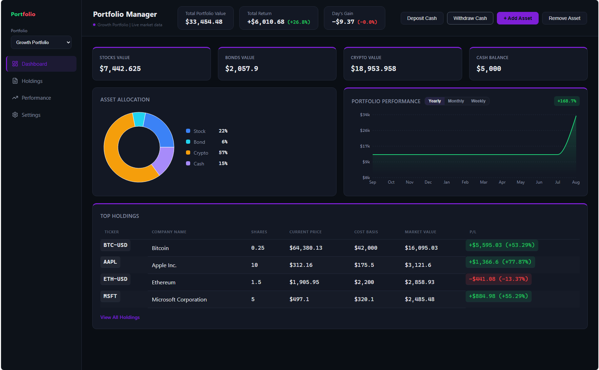
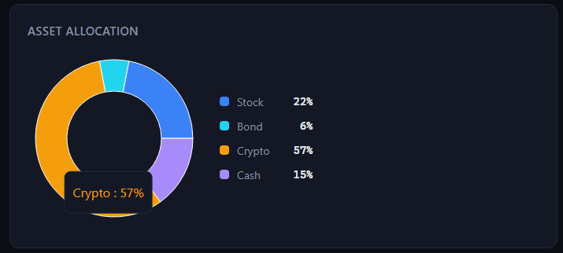
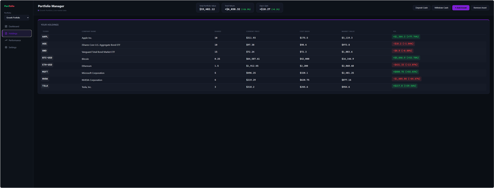
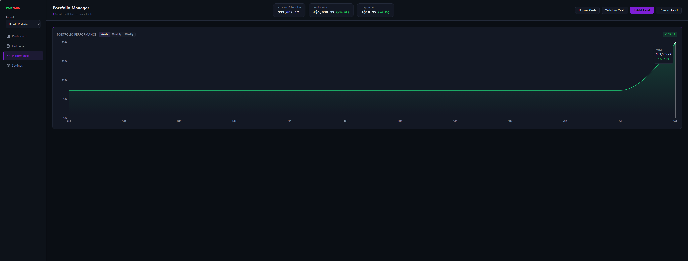
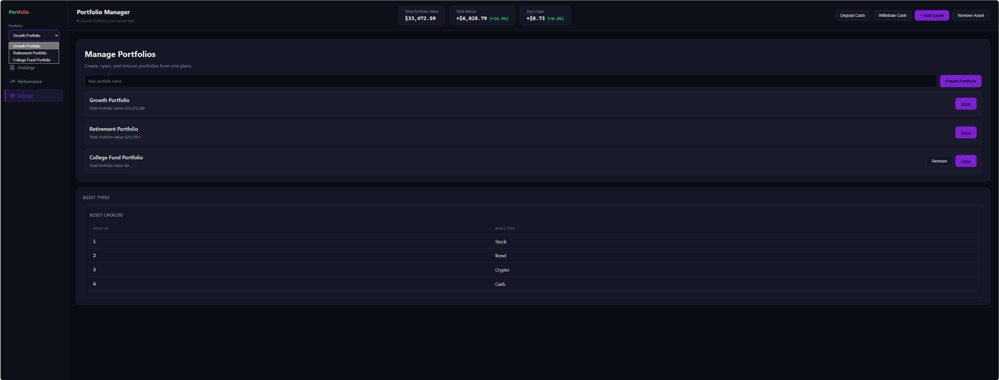
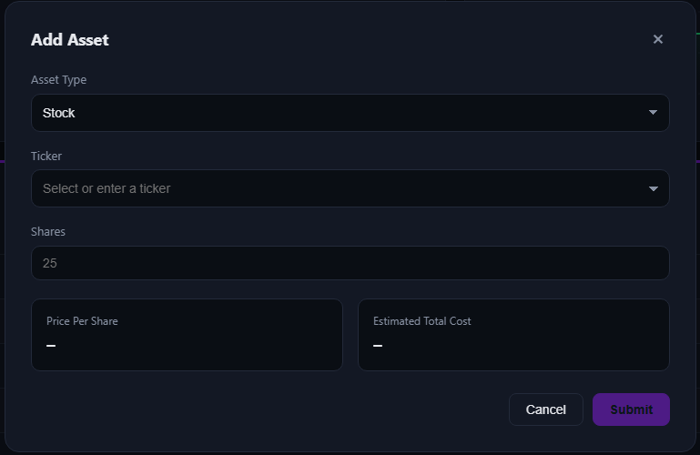
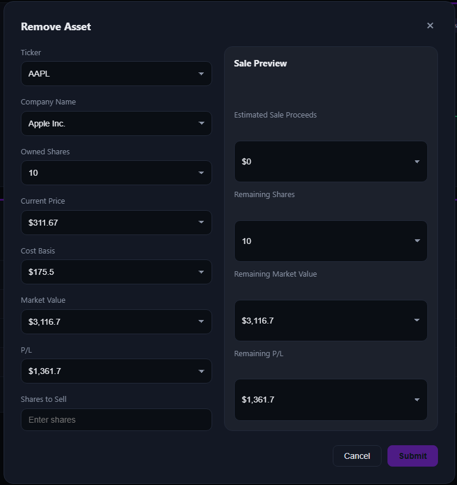
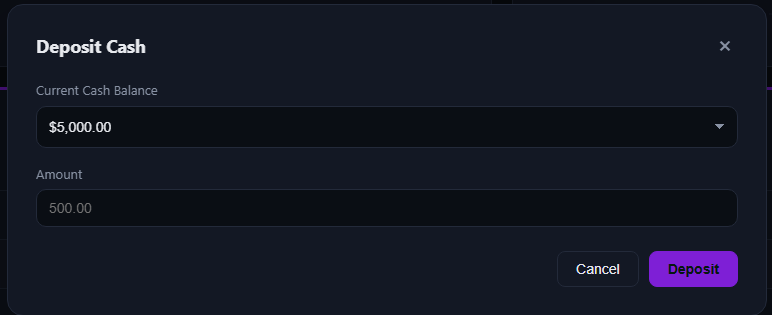
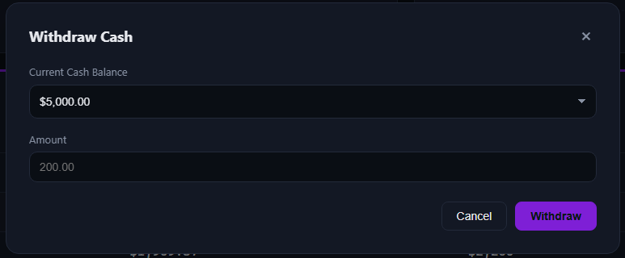

This is a repo for the CSF project with Group 4.

<h1 align="center">PortFolio</h1>

<p align="center">
  <strong>An open-source, portfolio manager.</strong>
  <br>Authors: Ihsane Majdoubi, Nate Wooster, Yvehenry Julsain
</p>

<picture>
  
</picture>

## Overview
### Description
PortFolio is a full-stack investment portfolio manager that lets users track and manage their holdings across stocks, bonds, and cryptocurrencies in one place. It connects to live market data through the Yahoo Finance API to price holdings in real time, letting users buy and sell assets, deposit or withdraw cash, and manage multiple portfolios side by side. A dashboard visualizes asset allocation, portfolio performance over time, and per-holding profit/loss, giving users a clear, up-to-date view of how their investments are doing.

### Features
A user is able to:
- Buy and sell various types of investment assets: stocks, bonds, and cryptocurrencies.
- Add or withdraw cash from their portfolios.
- Create multiple portfolios for multiple needs.
- Track the performance of their assets and the total value of their portfolio.

## Stack
### Tech Used
This project is mostly coded in Python for the backend and Javascript, HTML, and CSS for the frontend.

|Framework and Language|Description|
|---|---|
|**Flask** (Python)|A lightweight Python web framework used to build web applications and APIs|
|**MySQL** (SQL)|A database management system that supports SQL on various operating systems|
|**React** (JavaScript/HTML/CSS)|A JavaScript library designed for building user interface components|
|**Recharts** (JavaScript/HTML/CSS)|A composable charting library built on React components|
|**Vite** (JavaScript/HTML/CSS)|A frontend build tool used to deploy applications quickly|

### Layout
The application is separated into 4 major sections:
<table>
  <tbody>
    <tr><td><code>app</code></td><td>Holds database, backend API routes, input validation (security), and services</td></tr>
    <tr><td><code>scripts</code></td><td>Holds the scripts needed to initialize and connect the database</td></tr>
    <tr><td><code>frontend</code></td><td>Holds the code to render the portfolio application</td></tr>
    <tr><td><code>tests</code></td><td>Holds the code to test the multiple operations performed by the backend</td></tr>
  </tbody>
</table>

Important Files/Folders:
|Path|Usage|
|---|---|
|`app/database`|Holds the database schema and the code to display relevant information on application startup|
|`app/routes/api_routes.py`|Holds all the code connecting the frontend to the Yahoo Finance API, database, and portfolio performance analytics|
|`app/services`|Contains the CRUD operations on the database and API calls to the Yahoo Finance API|
|`tests`|Holds all the test files for the components mentionned above|
|`app/main.py`|This is the file executed to start the backend part of the application|
|`scripts/init_db.py`|This script starts the MySQL software and creates the database if non-existent|
|`frontend/src`|Holds all the UI components, styling information, and pages the user interacts with|

## How to Run
### Installing the Prerequisites
First, you need to clone the repository:

```sh
git clone https://github.com/Group4PortfolioManager/portfolio_manager_team04_group4.git
```
After cloning, you need to install these Python Packages (requires Python to be installed on your machine):

|Package|
|---|
|`Flask`|
|`Flask-Cors`|
|`Flask-restful`|
|`mysql-connector-python`|
|`pytest`|
|`requests`|
|`yfinance`|

To install, run this command

```sh
pip install <PACKAGE_NAME>
```
Ex: To install Flask, you would run this command: `pip install Flask`

### Envirorment Variables

Create a `.env` file at the root of the project and set these values:

|Variable|Value|
|---|---|
|`db_host`|The name of the host the database is being hosted on (Ex: `localhost`)|
|`db_user`|A username belonging to the profile who has access to the hosted database|
|`db_password`|The password of the user given in `db_user`|
|`db_name`|`portfolio_tracker`|

An example is available in the `.env.example` file in the repository.

### Starting the App
First, run this command from the root repository to start the backend:
```sh
python -m flask --app app.main run
```

The link of the backend API will be given in the terminal (Ex: http://127.0.0.1:3000)

In a separate terminal, go to the `frontend` folder:
```sh
cd ./frontend/
```
And run this command to start the frontend:
```sh
npm run dev
```
The link of the app will be given in the separate terminal (Ex: http://localhost:3000/).

### Running the Tests
In the root repository, run this command to start the tests:
```sh
python -m pytest --cov=app --cov-report=term-missing -q
```

## Screenshots
<table>
  <tr>
    <td width="50%">
      <picture>
        
      </picture>
      <p align="center"><sub><b>Asset Allocation</b> — see the distribution of your assets in your portfolio.</sub></p>
    </td>
    <td width="50%">
      <picture>
        
      </picture>
      <p align="center"><sub><b>Holdings</b> — all of the important information about your holdings is on this page.</sub></p>
    </td>
  </tr>
  <tr>
    <td width="50%">
      <picture>
        
      </picture>
      <p align="center"><sub><b>Performance</b> — can see the performance of your portfolio for the paast week, month, and year.</sub></p>
    </td>
    <td width="50%">
      <picture>
        
      </picture>
      <p align="center"><sub><b>Settings</b> — gives you the possibility to add, remove, and open your portfolios and see the different asset types available.</sub></p>
    </td>
  </tr>
  <tr>
    <td width="50%">
      <picture>
        
      </picture>
      <p align="center"><sub><b>Add Asset</b> — select the type of asset you want to purchase and the amount: fetches the cost for you and adds the asset to your portfolio.</sub></p>
    </td>
    <td width="50%">
      <picture>
        
      </picture>
      <p align="center"><sub><b>Sell Asset</b> — see how much profit you make when selling a part of your portfolio.</sub></p>
    </td>
  </tr>
  <tr>
    <td width="50%">
      <picture>
        
      </picture>
      <p align="center"><sub><b>Deposit Cash</b> — add more money to buy more assets in your portfolio.</sub></p>
    </td>
    <td width="50%">
      <picture>
        
      </picture>
      <p align="center"><sub><b>Withdraw Cash</b> — enjoy your profits: send cash from your portfolio to your bank account.</sub></p>
    </td>
  </tr>
</table>

## License
MIT.
